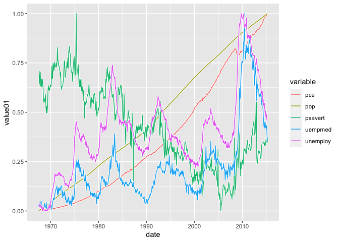
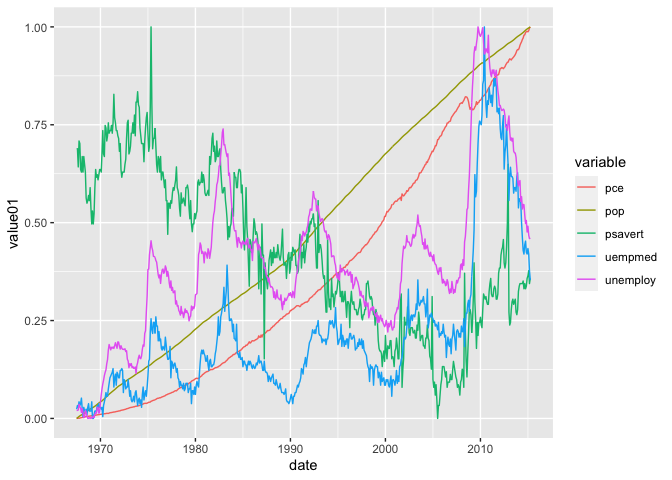
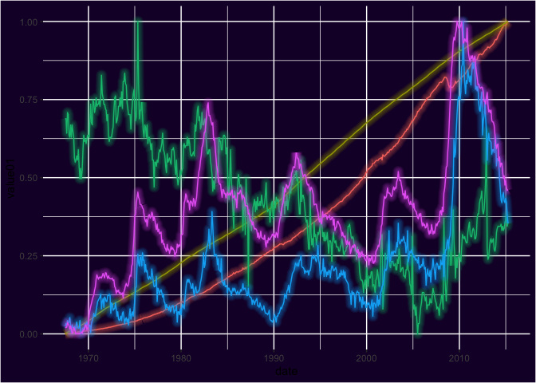
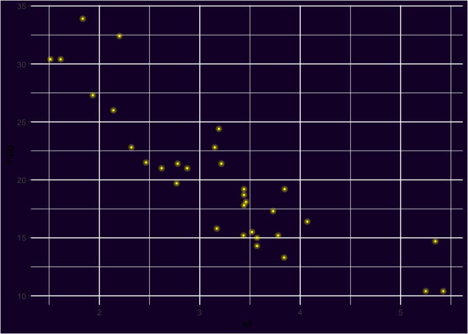

# `ggshadow`: Shadow Geoms for ggplot2

------------------------------------------------------------------------

# Website Link

Click [here](https://github.com/marcmenem/ggshadow) to go to where the original R package came from.

Click [here](https://jhu-statprogramming-fall-2022.github.io/biostat840-project3-pkgdown-ellazhichen/) to go to my deployed website.

#5 Customized Things

1.  I changed the whole background style of the pkgdown website.

2.  I changed the locations of each bottoms in Navbar.

3.  I customized the navigation bar that appears at the top of the page with the navbar field.

4.  I have change the name of the bottom in the navbar.

5.  I customized the footer field.

## :arrow_double_down: Installation


Get the development version from github:

```r
## install.packages("devtools")
devtools::install_github("marcmenem/ggshadow")
```


## :book: Vignette

```r
## after installing the package
vignette("ggshadow", package="ggshadow")
```

## :chart: Example

### With ggshadow

```{r}
library(ggplot2)
library(ggshadow)

ggplot(economics_long, aes(date, value01, colour = variable)) + geom_shadowline()

```




### Without ggshadow

```{r}
library(ggplot2)

ggplot(economics_long, aes(date, value01, colour = variable)) + geom_line()

```




### `ggshadow` supports varying the line color

```{r}
library(ggshadow)
library(ggplot2)

ggplot(economics_long, 
        aes(date, value01, 
            group = variable, 
            colour=value01, 
            shadowcolor='grey', 
            shadowalpha=0.5, 
            shadowsize=5*(1-value01))) + 
    geom_shadowline()

```


### `ggshadow` also provides a Neon glow style


```{r fig.height=7, fig.width=7}

ggplot(economics_long, aes(date, value01, color = variable)) + 
  geom_glowline() + guides(color='none') + 
  theme(plot.background = element_rect(fill = "#190132"),
        panel.background = element_rect(fill = "#190132")) 

```




### Neon glow points

```{r}

ggplot(mtcars, aes(wt, mpg)) + 
  geom_glowpoint(color='yellow') + 
  guides(color='none') + 
  theme(plot.background = element_rect(fill = "#190132"),
        panel.background = element_rect(fill = "#190132")) 

```



### Adding a fill below the neon glow line

```{r}
library(dplyr)

ggplot(filter( economics_long, variable %in% c('pop', 'unemploy') ), 
    aes(date, value01-0.5, color = variable, fill=variable)) + 
    geom_glowline() + guides(color='none', shadowcolour='none', fill='none') + 
    theme(plot.background = element_rect(fill = "#190132"),
           panel.background = element_rect(fill = "#190132")) 
```


